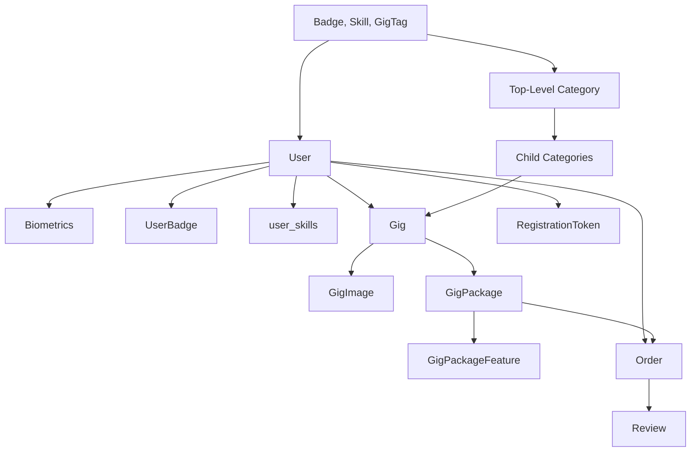

```mermaid
graph TD
    A[Badge, Skill, GigTag] --> B[User]
    B --> C[Biometrics]
    B --> D[UserBadge]
    B --> E[user_skills]
    A --> F[Top-Level Category]
    F --> G[Child Categories]
    B & G --> H[Gig]
    H --> I[GigImage]
    H --> J[GigPackage]
    J --> K[GigPackageFeature]
    B & J --> L[Order]
    L --> M[Review]
    B --> N[RegistrationToken]
```