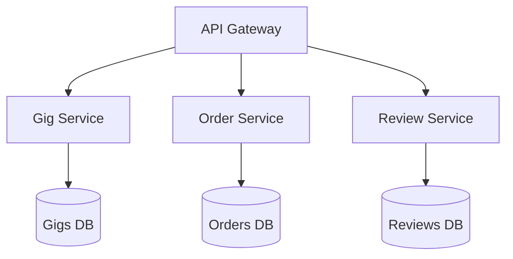

Here's a complete **Gig Microservice API** design for your marketplace scenario, with RESTful endpoints and example responses:

---

## **1. Gig Management Endpoints**

### **Create a New Gig**
`POST /api/gigs`

**Request (Seller Auth Required)**
```json
{
  "title": "Professional Website Development",
  "description": "I'll build you a responsive website",
  "categoryId": "3fa85f64-5717-4562-b3fc-2c963f66afa6",
  "tags": ["frontend", "web"],
  "packages": [
    {
      "title": "Basic Website",
      "description": "5-page site",
      "price": 500,
      "deliveryDays": 14,
      "features": ["Responsive Design", "Contact Form"]
    }
  ]
}

```

**Response (201 Created)**
```json
{
  "id": "550e8400-e29b-41d4-a716-446655440000",
  "title": "Professional Website Development",
  "sellerId": "110e8400-e29b-41d4-a716-446655440000",
  "status": "ACTIVE",
  "createdAt": "2023-08-20T10:00:00Z"
}
```

---

### **Get Gig Details**
`GET /api/gigs/{gigId}`

**Response (200 OK)**
```json
{
  "id": "550e8400-e29b-41d4-a716-446655440000",
  "title": "Professional Website Development",
  "description": "I'll build you a responsive website",
  "rating": 4.8,
  "seller": {
    "id": "110e8400-e29b-41d4-a716-446655440000",
    "username": "webdev_pro",
    "badges": ["Top Seller"]
  },
  "packages": [
    {
      "id": "aa0e8400-e29b-41d4-a716-446655440000",
      "title": "Basic Website",
      "price": 500,
      "deliveryDays": 14
    }
  ],
  "images": [
    {"url": "https://cdn.example.com/gig1.jpg", "isPrimary": true}
  ]
}
```

---

## **2. Package Management**

### **Add Package to Gig**
`POST /api/gigs/{gigId}/packages`  
*(Seller Auth Required - Must own gig)*

**Request**
```json
{
  "title": "Premium Website",
  "description": "10-page site with CMS",
  "price": 1000,
  "deliveryDays": 21,
  "features": ["CMS Included", "SEO Setup"]
}
```

**Response (201 Created)**
```json
{
  "id": "bb0e8400-e29b-41d4-a716-446655440000",
  "gigId": "550e8400-e29b-41d4-a716-446655440000",
  "title": "Premium Website"
}
```

---

## **3. Order Endpoints**

### **Place Order**
`POST /api/orders`  
*(Buyer Auth Required)*

**Request**
```json
{
  "packageId": "aa0e8400-e29b-41d4-a716-446655440000",
  "requirements": "Need dark theme",
  "paymentMethod": "stripe"
}
```

**Response (201 Created)**
```json
{
  "orderId": "dd0e8400-e29b-41d4-a716-446655440000",
  "gigTitle": "Professional Website Development",
  "package": "Basic Website",
  "price": 500,
  "status": "PENDING",
  "dueDate": "2023-09-03T10:00:00Z"
}
```

---

## **4. Review Endpoints**

### **Submit Review**
`POST /api/orders/{orderId}/review`  
*(Buyer Auth Required - Must be order buyer)*

**Request**
```json
{
  "rating": 5,
  "comment": "Excellent work! Delivered early."
}
```

**Response (201 Created)**
```json
{
  "reviewId": "ff0e8400-e29b-41d4-a716-446655440000",
  "gigId": "550e8400-e29b-41d4-a716-446655440000",
  "newAverageRating": 4.9
}
```

---

## **5. Search & Discovery**

### **Search Gigs**
`GET /api/gigs?category=web-dev&minPrice=300&maxPrice=1000`

**Response (200 OK)**
```json
{
  "results": [
    {
      "id": "550e8400-e29b-41d4-a716-446655440000",
      "title": "Professional Website Development",
      "startingPrice": 500,
      "rating": 4.8,
      "seller": {
        "username": "webdev_pro",
        "badges": ["Top Seller"]
      },
      "thumbnail": "https://cdn.example.com/gig1-thumb.jpg"
    }
  ],
  "total": 27
}
```

---

## **Error Responses**

**401 Unauthorized**  
*(Missing/invalid auth token)*
```json
{
  "error": "Authentication required",
  "code": "UNAUTHORIZED"
}
```

**403 Forbidden**  
*(User doesn't own resource)*
```json
{
  "error": "You don't have permission to modify this gig",
  "code": "FORBIDDEN"
}
```

**404 Not Found**  
*(Gig/order doesn't exist)*
```json
{
  "error": "Gig not found",
  "code": "NOT_FOUND"
}
```

---

## **Service Architecture**


/gig
├── /                  (GET)       - List/Search gigs
├── /                  (POST)      - Create new gig
├── /{gigId}           (GET)       - Get gig details
├── /{gigId}           (PUT)       - Update gig
├── /{gigId}           (DELETE)    - Delete gig
├── /{gigId}/packages  (GET)       - List packages
├── /{gigId}/packages  (POST)      - Add package
├── /{gigId}/images    (POST)      - Upload images
└── /{gigId}/status    (PATCH)     - Toggle active status make this md