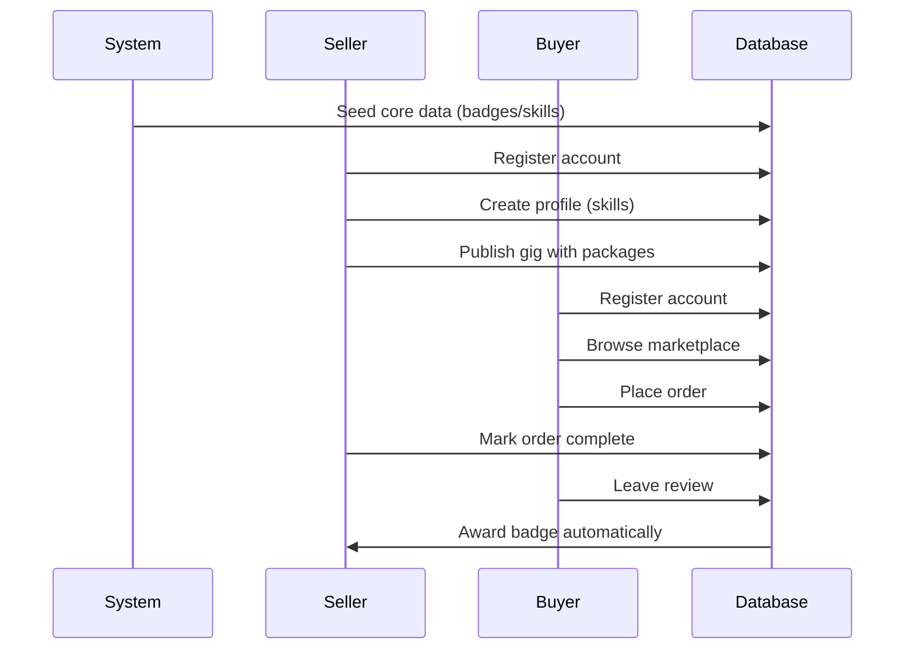

## User-Centric Database Initialization Flow

### 1. System Setup (Automatic)
```sql
-- System automatically creates foundational data on first launch
INSERT INTO "Badge" (label, icon, color) VALUES 
('Top Seller', 'medal', 'gold'),
('Fast Delivery', 'rocket', 'blue');

INSERT INTO "Skill" (label) VALUES
('Web Development'),
('Graphic Design');

INSERT INTO "Category" (label, slug) VALUES
('Digital Services', 'digital-services'),
('Creative Design', 'creative-design');
```

### 2. First User Onboards (Seller)
```sql
-- User self-registers
INSERT INTO "User" (email, username, country) 
VALUES ('seller@example.com', 'freelancer1', 'US');

-- User adds their skills
INSERT INTO user_skills ("userId", "skillId", level)
VALUES (
  (SELECT id FROM "User" WHERE email='seller@example.com'),
  (SELECT id FROM "Skill" WHERE label='Web Development'),
  3
);

-- User creates their first gig
WITH new_gig AS (
  INSERT INTO "Gig" (title, "sellerId", "categoryId")
  VALUES ('Website Development', 
         (SELECT id FROM "User" WHERE email='seller@example.com'),
         (SELECT id FROM "Category" WHERE slug='digital-services'))
INSERT INTO "GigPackage" (title, "gigId", price)
VALUES ('Basic Package', (SELECT id FROM new_gig), 299);
```

### 3. Second User Joins (Buyer)
```sql
-- New user registers
INSERT INTO "User" (email, username, country)
VALUES ('buyer@example.com', 'client1', 'UK');

-- Buyer browses and purchases
INSERT INTO "Order" ("buyerId", "sellerId", "packageId")
VALUES (
  (SELECT id FROM "User" WHERE email='buyer@example.com'),
  (SELECT id FROM "User" WHERE email='seller@example.com'),
  (SELECT id FROM "GigPackage" WHERE title='Basic Package')
);
```

### 4. Post-Transaction Activities
```sql
-- Seller earns badge
INSERT INTO "UserBadge" ("userId", "badgeId")
VALUES (
  (SELECT id FROM "User" WHERE email='seller@example.com'),
  (SELECT id FROM "Badge" WHERE label='Top Seller')
);

-- Buyer leaves review
INSERT INTO "Review" ("orderId", "authorId", rating)
VALUES (
  (SELECT id FROM "Order" LIMIT 1),
  (SELECT id FROM "User" WHERE email='buyer@example.com'),
  5
);
```

## User-Driven Workflow Diagram



Key Characteristics:
1. **Self-Service Model**: All actions initiated by users
2. **Organic Growth**: Marketplace evolves as users join
3. **Automatic Badging**: System awards achievements
4. **Minimal Pre-Requisites**: Only essential seed data created automatically

This flow eliminates admin overhead while maintaining data integrity through:
- Smart defaults (auto-timestamps, UUIDs)
- Foreign key constraints
- Business logic in application layer